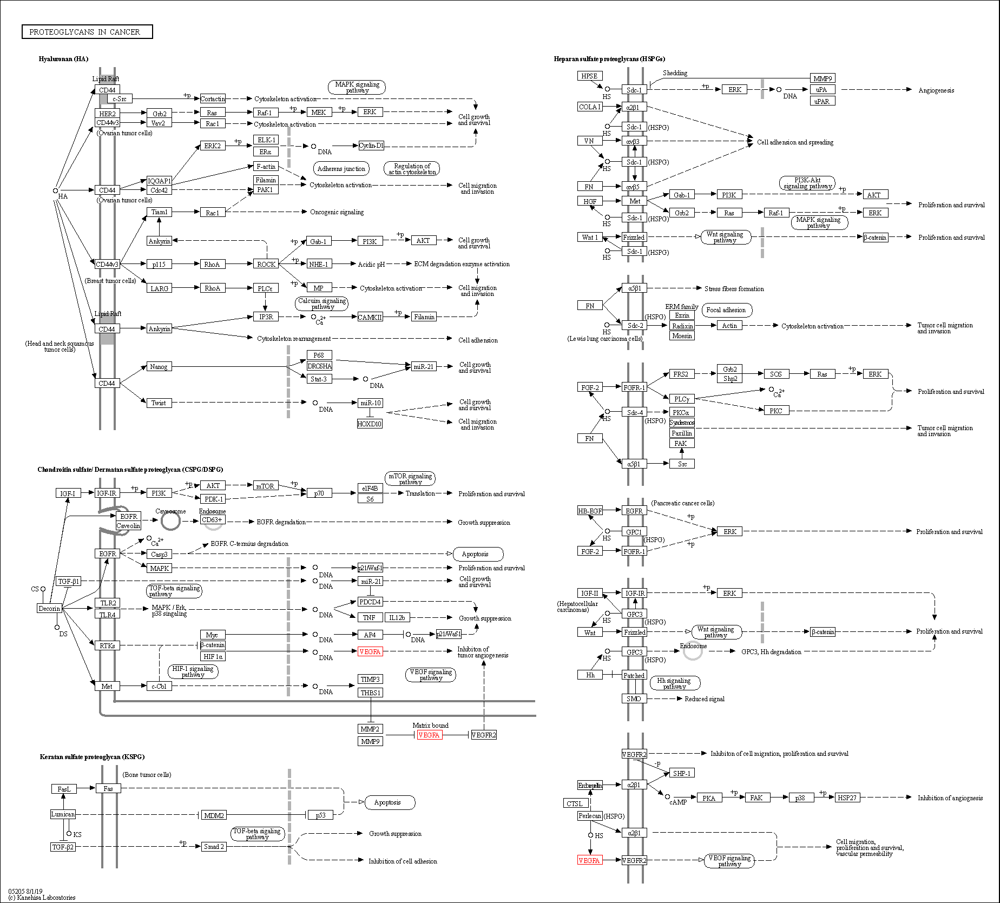

# Open Biopipeline
This project was inspired by my intro to biomedical engineering lab course. This fully automates and streamlines the process of analyzing unknown sequence data. You can view the python notebook below to see a working version. Parts of this pipeline is left out as to prevent future students from cheating.

## Demo
[Python Notebook](https://colab.research.google.com/drive/1lRdys_SpBH4HugSSRcW8S678T-r7NYXV)

Please note this is not the full pipeline, just simply the blastn search portion.

## Packages
- Biopython
- NCBI BLAST 2.10.0+
- KEGG
- UniProt
- Protein Atlas


## Installation
### Windows and MacOS
Go to NCBI website [here](https://ftp.ncbi.nlm.nih.gov/blast/executables/blast+/LATEST/) and download the installer. Install as you would any .exe program

### Linux dependencies
```
uname -i
sudo apt-get install lftp
lftp -e "cd blast/executables/LATEST; dir; quit" ftp.ncbi.nlm.nih.gov | awk '{print $NF}'
wget ftp://ftp.ncbi.nlm.nih.gov/blast/executables/blast+/LATEST/ncbi-blast-2.10.0+-x64-linux.tar.gz

tar -xzvf ncbi-blast-2.10.0+-x64-linux.tar.gz

# remove tar file
rm ncbi-blast-2.10.0+-x64-linux.tar.gz

cd ncbi-blast-2.10.0+
```
```
# so you can run the bin commands without specifying directory
export PATH = $PATH:$PWD

# or

export PATH = $PATH:$HOME/content/ncbi-blast-2.10.0+/bin
```
BLAST commands should work now, the following command should return an output other than "Unknown command".

```
blastn -version
```

### Python Setup
```
pip install virtualenv

virtualenv bio_pipeline

env\scripts\activate

pip install -r requirements.txt

```


## Results
Starting with an unknown sequence of nucleotides the program is fed into the BLAST algorithm to pairwise match the nucleotides for a specific gene. Refer to [gene_items.md](gene_items.md) for the gene name and accession number of the example genes given.

The next step is to understand the gene/protein function by using the UniProt database. By inputting a gene name, we can look for the specific amino acid sequence AND the protein function. You can see here that we don't use gene ontologogy (GO) directly in our analysis since functional annotation is not only partially given by UniProt, but one can retrieve GO information from UniProt links.

Next, we preform pathway analysis on the targeted gene so one can identify the cellular response of the specific cell cascade. This helps us gain understanding of the upstream and downstream molecules; moreover, this can aid in therapeutic drug research. Refer to figure 1 for the pathway interactions of vascular endothelial growth factor A (VEGFA) gene.

<p align="center">
  
</p>
<p align="center"><b>Figure 1.</b> Cell signaling cascade of the VEGFA protein (Note the specific link to angiogenesis, making it a target for cancer research)</p>

Lastly, we pass through the gene name into Protein Atlas which gives us valuable and relevant information on the protein expression in patients. This proves very desirable since one can now look at specific RNA cancer expression or the description of the protein within the clinical context. Below is an example of the Protein Atlas output:
```
0 Protein Name: VEGFA
  Tissue expression summary:  Most cancers showed strong cytoplasmic immunoreactivity. Lymphomas were in general moderately stained.
  Description:  Antibody staining mainly consistent with RNA expression data. At least one protein variant secreted, tissue location of RNA and protein might differ and correlation is complex.  
  RNA Cancer Specificity: Low cancer specificity

...
```

## Pipeline flow
<p align="center">
  
</p>

<p align="center"><b>Figure 2.</b> Flow chart diagram of bioinformatic pipeline, displaying flow of input/outputs</p>

## Contributing
Pull requests are welcome. For major changes, please open an issue first to discuss what you would like to change.

Please make sure to update tests as appropriate.

## License
[MIT](https://choosealicense.com/licenses/mit/)
